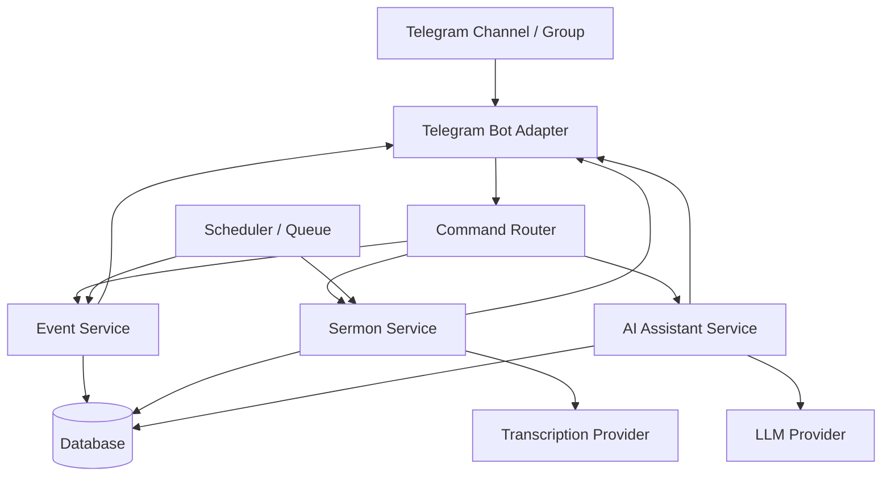

# Architecture

## Overview

The MVP should be built as a modular bot service with a database, background jobs, AI processing, and clear admin boundaries.

## Modules

### Telegram Bot Adapter

Responsible for:

- receiving Telegram updates;
- normalizing messages;
- downloading audio files;
- sending group and private messages;
- hiding Telegram-specific API details from business logic.

### Command Router

Responsible for:

- parsing commands;
- checking roles;
- routing requests to services;
- returning user-friendly responses.

### Event Service

Responsible for:

- event creation and updates;
- recurring schedule rules;
- reminder calculation;
- message template rendering.

### Sermon Service

Responsible for:

- audio intake;
- transcription status;
- transcript storage;
- summary generation;
- follow-up post generation;
- review and publishing state.

### AI Assistant Service

Responsible for:

- Bible and church-life Q&A;
- prompt safety boundaries;
- answer formatting;
- escalation to leaders;
- optional retrieval from sermon archive.

### Scheduler / Queue

Responsible for:

- sending reminders at the right time;
- running sermon follow-up jobs;
- retrying failed tasks;
- recording job status.

## Initial Data Model

Core tables:

- `users`
- `church_groups`
- `roles`
- `events`
- `reminders`
- `sermons`
- `sermon_transcripts`
- `generated_posts`
- `ai_conversations`
- `audit_logs`
- `settings`

## Reliability Requirements

- Reminder jobs must be idempotent.
- Failed jobs must be retried and logged.
- Generated AI content should be reviewable before group publishing.
- Admin actions should be auditable.
- Timezone must be explicit.

## Security Requirements

- Store secrets only in environment variables or secret manager.
- Never commit tokens.
- Restrict admin commands by user ID.
- Treat prayer requests and private messages as sensitive data.
- Keep logs useful but avoid unnecessary personal content.
